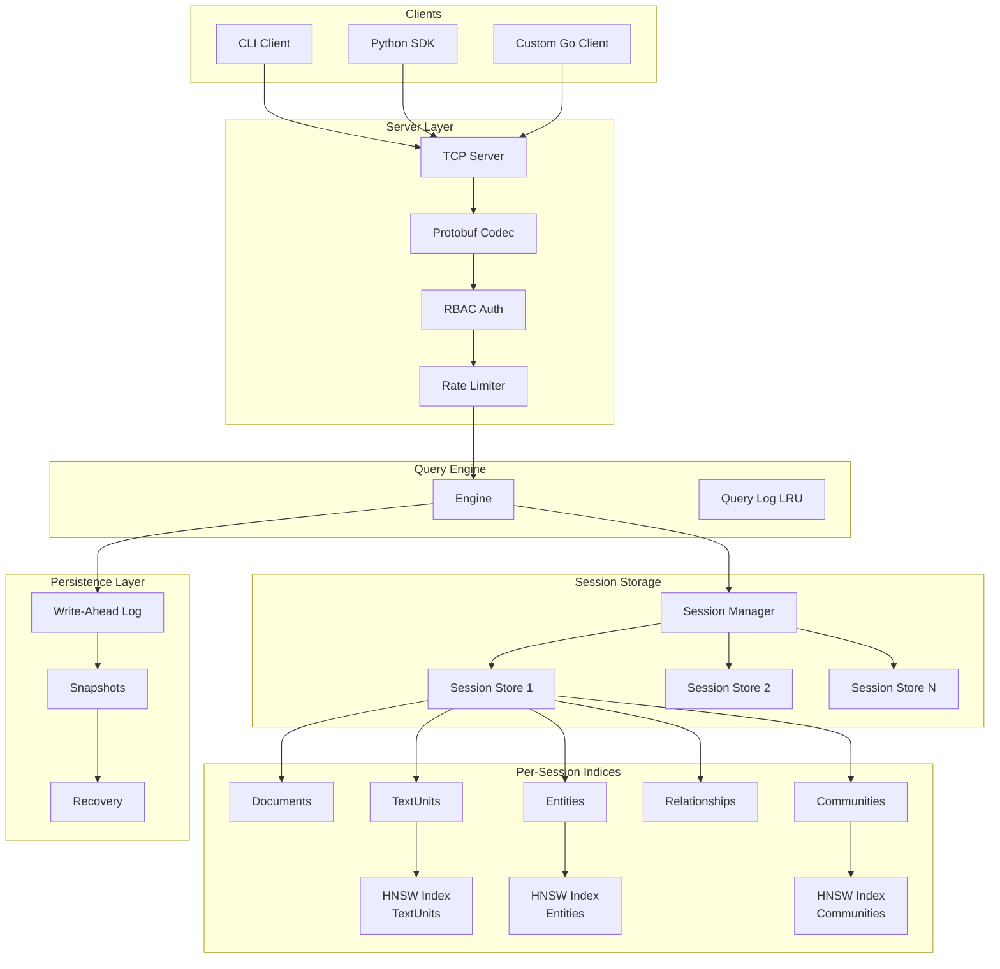
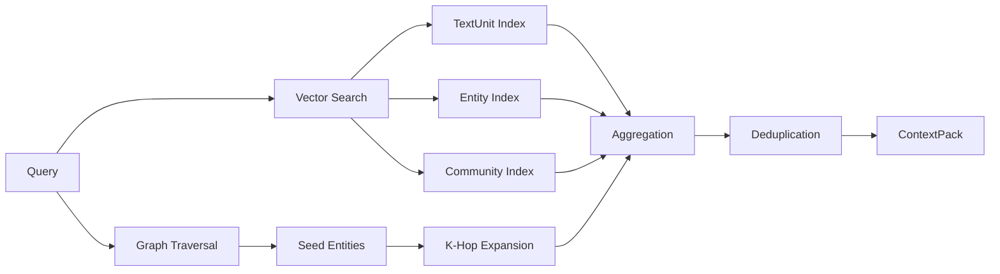
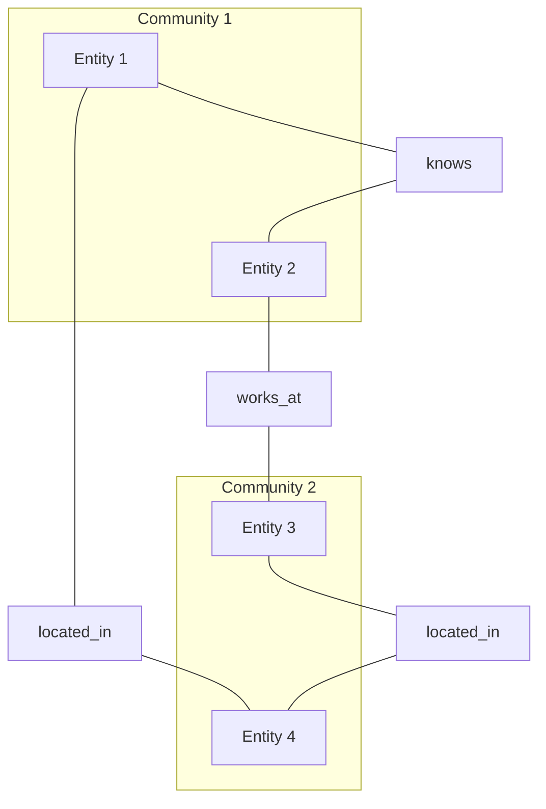
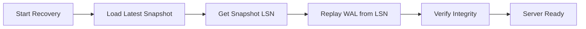
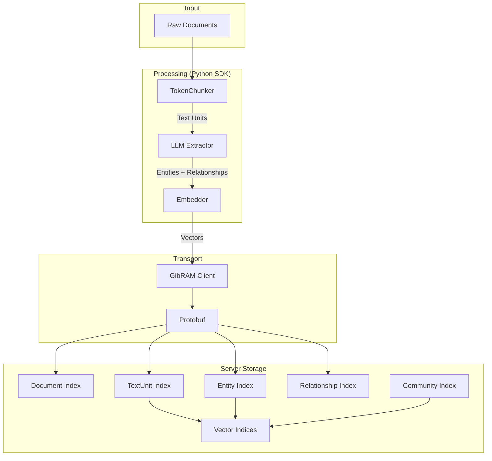
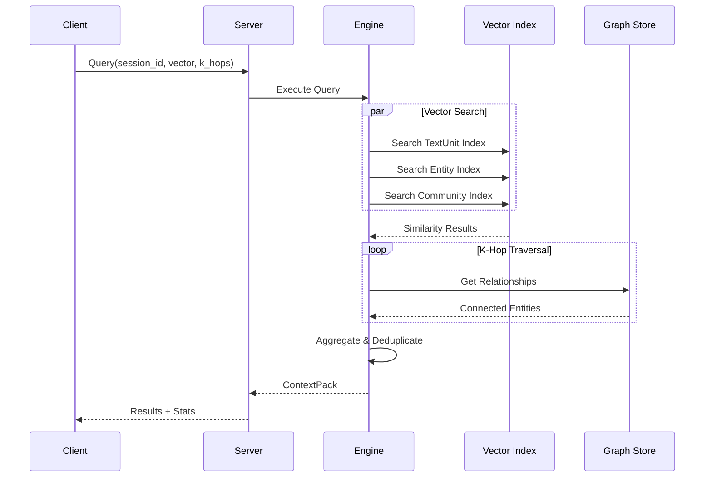
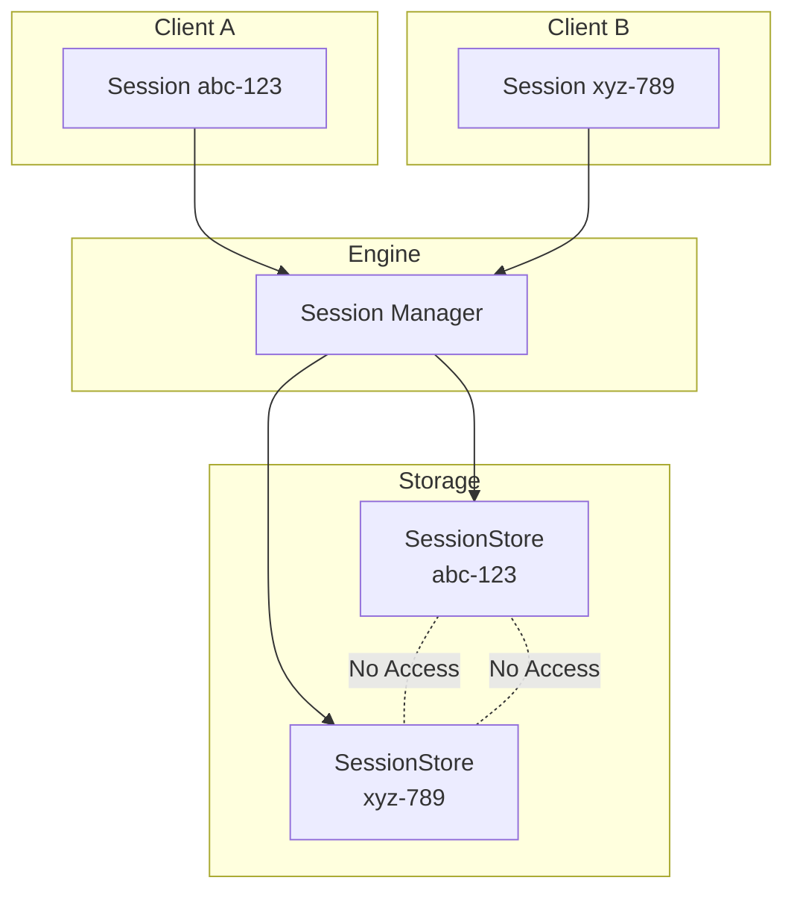
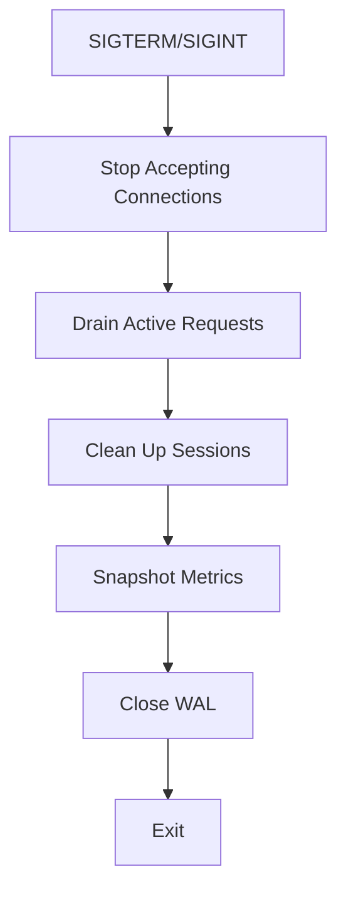

# GibRAM Architecture

**GibRAM** (Graph in-Buffer Retrieval & Associative Memory) is a high-performance, in-memory knowledge graph server designed for Retrieval Augmented Generation (RAG) workflows.

## System Overview



## Core Components

### 1. Server (`pkg/server/`)

The TCP server handles client connections using a custom binary protocol over TLS or plain TCP.

**Responsibilities:**
- Connection lifecycle management
- Protocol framing (4-byte length prefix + protobuf payload)
- Session binding per client
- Authentication and authorization
- Rate limiting and connection limits

**Wire Protocol:**
```
┌─────────┬────────────┬──────────────┬─────────┬────────────┐
│ Version │ Request ID │ Command Type │ Payload │ Session ID │
│ (1 byte)│ (4 bytes)  │ (2 bytes)    │ (var)   │ (var)      │
└─────────┴────────────┴──────────────┴─────────┴────────────┘
```

### 2. Engine (`pkg/engine/`)

The query execution engine coordinates vector search and graph traversal across sessions.

**Responsibilities:**
- Session lifecycle (creation, TTL, cleanup)
- Query execution combining vector similarity and graph traversal
- Query logging with LRU eviction (10K entries)
- Idle session detection and expiration



### 3. Store (`pkg/store/`)

Per-session isolated storage with multiple indices for different data types.

**Data Structures:**
- Documents: Full text with metadata
- TextUnits: Chunked text with embeddings
- Entities: Named entities with types and descriptions
- Relationships: Typed edges between entities with weights
- Communities: Hierarchical entity clusters

**Index Types:**
- Primary: ID-based lookup (O(1))
- Secondary: External ID, title, document ID lookups
- Vector: HNSW indices for semantic search

### 4. Vector (`pkg/vector/`)

HNSW (Hierarchical Navigable Small World) implementation for approximate nearest neighbor search.

**Configuration:**
- `M`: Maximum connections per node (default: 16)
- `Ef`: Search candidate list size (default: 200)
- Dimension: Configurable (typically 1536 for OpenAI embeddings)

**Operations:**
- Add/Remove vectors with IDs
- K-nearest neighbor search by cosine similarity
- Serialization for snapshots

**Performance:**
- O(log N) search complexity
- SIMD-optimized distance calculations (AMD64)

### 5. Graph (`pkg/graph/`)

Community detection using the Leiden algorithm.

**Features:**
- Resolution-tunable clustering
- Hierarchical community levels
- Weighted edge support
- Incremental updates



### 6. Backup (`pkg/backup/`)

Durability through WAL and snapshots.

**Write-Ahead Log:**
- Entry types: Insert, Update, Delete, Checkpoint
- 64MB segment rotation
- Configurable sync modes (every write, periodic, buffered)
- LSN (Log Sequence Number) tracking

**Snapshots:**
- Point-in-time compressed backups (gzip)
- Atomic write-to-temp pattern
- CRC32 checksums
- LSN correlation for recovery

**Recovery Flow:**


### 7. Client (`pkg/client/`)

Go client library with connection pooling.

**Features:**
- Configurable connection pool with health checks
- TLS support with certificate verification
- API key authentication
- Request ID correlation
- Automatic reconnection

## Data Flow

### Indexing Pipeline



### Query Execution



## Session Isolation

Each client operates in a fully isolated session with independent:
- Data storage (documents, entities, relationships)
- Vector indices
- ID generators
- TTL and idle timeout



## Security Model

### Authentication
- API key-based authentication
- Keys configured in YAML with permission levels

### Authorization (RBAC)
- **read**: Query, get operations
- **write**: Add, update, delete operations
- **admin**: Backup, restore, session management

### Rate Limiting
- Per-IP connection limits
- Global request rate limiting
- Configurable burst allowance

### TLS
- Auto-generated certificates for development
- Custom certificate support for production
- Optional skip-verify for testing

## Protocol Commands

130+ command types organized by category:

| Category | Range | Examples |
|----------|-------|----------|
| Basic | 1-9 | PING, INFO, HEALTH |
| Document | 10-19 | ADD_DOC, GET_DOC, DEL_DOC |
| TextUnit | 20-29 | ADD_TU, GET_TU, LINK_TU |
| Entity | 30-39 | ADD_ENT, GET_ENT, UPDATE_ENT |
| Relationship | 40-49 | ADD_REL, GET_REL, DEL_REL |
| Community | 50-59 | ADD_COM, COMPUTE_LEIDEN |
| Query | 60-69 | QUERY, EXPLAIN |
| Session | 70-79 | LIST, DELETE, SET_TTL |
| Bulk | 80-91 | MSET_*, MGET_* |
| Pipeline | 100-101 | PIPELINE_EXEC |
| Backup | 110-119 | SAVE, RESTORE, WAL_* |
| Auth | 120-121 | AUTH |

## Directory Structure

```
gibram/
├── cmd/
│   ├── server/main.go          # Server entry point
│   └── cli/main.go             # Interactive CLI
├── pkg/
│   ├── engine/                 # Query execution
│   ├── store/                  # Session storage
│   ├── vector/                 # HNSW implementation
│   ├── graph/                  # Leiden algorithm
│   ├── server/                 # TCP server
│   ├── client/                 # Go client
│   ├── backup/                 # WAL & snapshots
│   ├── types/                  # Data structures
│   ├── config/                 # Configuration
│   ├── codec/                  # Protocol codec
│   ├── logging/                # Structured logging
│   ├── metrics/                # Performance metrics
│   ├── memory/                 # Memory tracking
│   ├── resilience/             # Circuit breaker
│   ├── pool/                   # Object pooling
│   ├── simd/                   # SIMD optimizations
│   └── shutdown/               # Graceful shutdown
├── proto/
│   ├── gibram.proto            # Protocol definition
│   └── gibrampb/               # Generated code
├── sdk/
│   └── python/                 # Python SDK
└── examples/                   # Usage examples
```

## Configuration

```yaml
server:
  addr: ":6161"
  data_dir: "./data"
  vector_dim: 1536

tls:
  cert_file: ""
  key_file: ""
  auto_cert: true

auth:
  keys:
    - id: "admin"
      key: "secret"
      permissions: ["admin"]

security:
  max_frame_size: 4194304  # 4MB
  rate_limit: 1000         # req/sec
  rate_burst: 100
  idle_timeout: 300s
```

## Performance Characteristics

| Aspect | Characteristic |
|--------|----------------|
| Vector Search | O(log N) via HNSW |
| Graph Traversal | O(edges × k-hops) |
| Session Lookup | O(1) map access |
| Memory Model | In-memory only (ephemeral without persistence) |
| Concurrency | Session-level isolation, no cross-session locks |
| Max Sessions | 10,000 (configurable DoS protection) |
| Query Log | 10,000 entries LRU |

## Graceful Shutdown

Shutdown follows a prioritized sequence:



Timeout: 30 seconds maximum.

## External Dependencies

### Go
- `google.golang.org/protobuf` - Protocol Buffers
- `golang.org/x/crypto` - TLS, bcrypt
- `golang.org/x/time/rate` - Rate limiting
- `gopkg.in/yaml.v3` - Configuration
- `github.com/cespare/xxhash/v2` - Fast checksums

### Python SDK
- `openai` - LLM and embeddings
- `grpcio-tools` - Protocol compilation
- `click` - CLI interface

## Integration Points

| Integration | Purpose |
|-------------|---------|
| OpenAI API | Entity extraction, embedding generation |
| TLS Certificates | Transport security |
| File System | WAL segments, snapshots |
| Docker | Container deployment |
